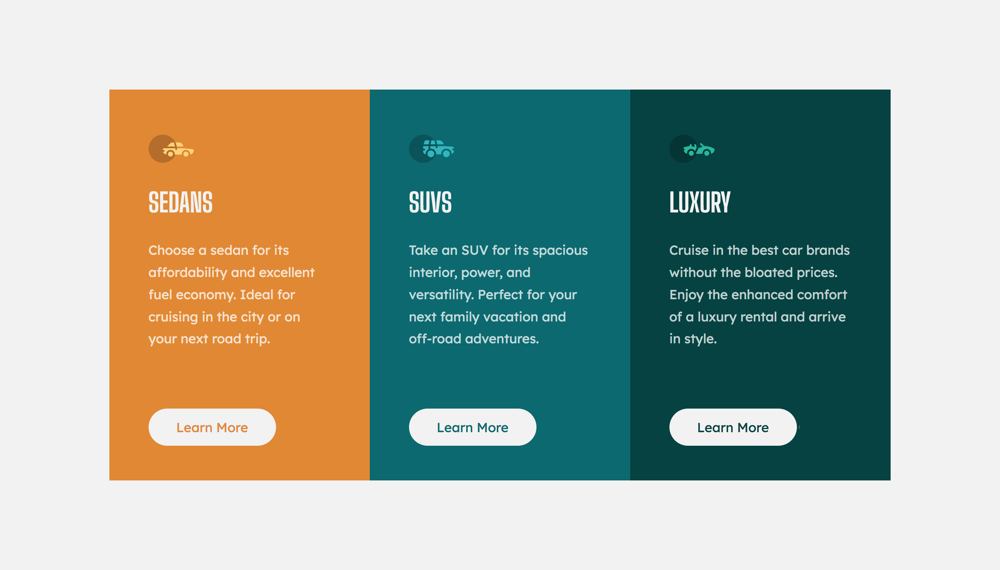

# Frontend Mentor - 3-column preview card component solution

This is a solution to the [3-column preview card component challenge on Frontend Mentor](https://www.frontendmentor.io/challenges/3column-preview-card-component-pH92eAR2-). Frontend Mentor challenges help you improve your coding skills by building realistic projects.

## Table of contents

- [Overview](#overview)
  - [The challenge](#the-challenge)
  - [Screenshot](#screenshot)
  - [Links](#links)
- [My process](#my-process)
  - [Built with](#built-with)
  - [What I learned](#what-i-learned)
  - [Continued development](#continued-development)
  - [Useful resources](#useful-resources)
- [Author](#author)
- [Acknowledgments](#acknowledgments)

**Note: Delete this note and update the table of contents based on what sections you keep.**

## Overview

### The challenge

Users should be able to:

- View the optimal layout depending on their device's screen size
- See hover states for interactive elements

### Screenshot



### Links

- Solution URL: [Add solution URL here](https://your-solution-url.com)
- Live Site URL: [Add live site URL here](https://your-live-site-url.com)

## My process

- Read instructions
- Analyize design, observe document flow and element structure.
- Wrote the html code first
- Then applied styles in css
- Edited the README-template
- create repository and publish code on git
- submit assigment, share project and get feedback

### Built with

- Semantic HTML5 markup
- CSS
- CSS Grid

### What I learned

i learnt about the <section> tag, it was stated that section can be used to create cards in html and also, i learnt that section can be nested inside a div.

example:

```html
<div class="container">
  <section class="product-card product-card--sedans">
    
    <h1 class="product-heading">Sedans</h1>
    <p class="product-text">
      Choose a sedan for its affordability and excellent fuel economy. Ideal for
      cruising in the city or on your next road trip.
    </p>
    <a class="product-link product-link--sedans" href="#">Learn More</a>
  </section>
</div>
```

### Continued development

i intend on building more components, then webpages, websites using html, css and javascript and frontend tools.

### Useful resources

- [resource 1](https://bard.google.com/chat/b6baf8cc703d573f) - This helped me for information on semantic html and nesting elements

## Author

- Website - [Maduka Chisom](https://www.your-site.com)
- Frontend Mentor - [@chisomwest](https://www.frontendmentor.io/profile/chisomwest)
- Twitter - [@ChisomGMaduka](https://twitter.com/ChisomGMaduka)

## Acknowledgments

My Tutor Jonas Schmedtmann
